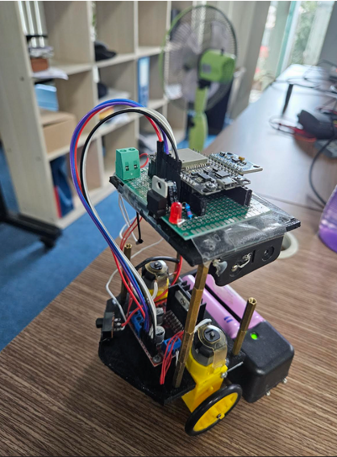
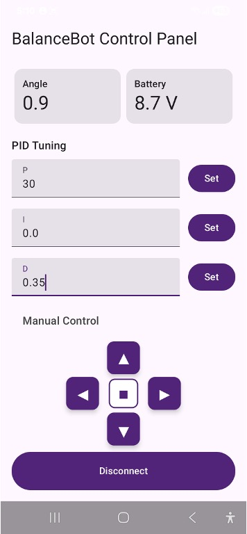

# Self Balancing Robot (ESP32)

A compact, two wheeled autonomous robot that utilises active PID feedback control loops and real time Bluetooth communication to maintain upright equilibrium and receive wireless telemetry.

## System Showcase
| Physical Hardware Assembly | Jetpack Compose Android UI |
| :---: | :---: |
|  |  |

## Key Technical Features
* **Complementary Sensor Fusion:** Implemented a real time complementary filtering algorithm to execute sensor fusion on high speed accelerometer and gyroscope datasets, effectively neutralising mechanical vibrations and sensor drift to calculate precise incline angles.
* **Active PID Feedback Loops:** Developed physics based control algorithms executing at 200Hz to dynamically adjust motor torque and maintain physical balance based on filtered sensor data.
* **Wireless BLE Telemetry:** Integrated a Bluetooth Low Energy stack on the ESP32 to stream real time battery statistics, current incline angle data, and telemetry directly to a mobile device.
* **Dynamic Gain Tuning:** Developed firmware routines capable of processing live wireless packets, allowing users to tune PID coefficients over the air without reflashing the chip.

## Mobile Application
* Designed and built a custom Android companion application from scratch using **Kotlin**, **Android Studio**, and **Jetpack Compose** for modern, declarative user interface development.
* Engineered a clean dashboard UI using Compose state management to handle live wireless telemetry packets smoothly and update interactive UI components dynamically.
* Programmed wireless transmitter routines to send directional driving commands and live PID parameter updates to the hardware platform.

## Hardware & Tools Stack
* **Microcontroller:** ESP32 (C++ via VS Code and PlatformIO)
* **Sensors:** MPU6051 Inertial Measurement Unit
* **Actuators:** Dual DC Motors + L298N Dual H-Bridge Motor Driver
* **Mobile Stack:** Kotlin, Android Studio, Jetpack Compose, Bluetooth Low Energy Architecture